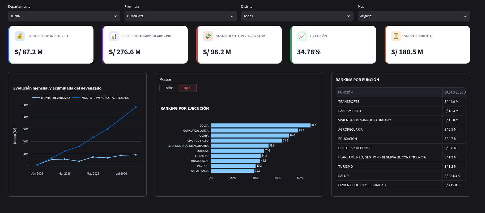

# BUDGET & EXPENDITURE – LOCAL GOVERNMENTS – MUNICIPALITIES, PERU 2026 📊


## Context

Although public budget information is available through platforms such as [Peru's Economic Transparency Portal](https://apps5.mineco.gob.pe/transparencia/Mensual/default.aspx?y=2026&ap=Proyecto), querying and exploring budget data for local governments can be cumbersome, especially for users who are not familiar with the platform.

The solution is to transform public financial data into an interactive analytical dashboard developed with Python and Streamlit, allowing users to explore key budget indicators through geographic and time-based filters.

## Project Overview

This project aims to transform public budget and expenditure of data [MEF](https://datosabiertos.mef.gob.pe/dataset/presupuesto-y-ejecucion-de-gasto/resource/d45f660d-6d14-438e-9d91-300084c9b85f) into information that can be explored more easily, with a focus on accessibility for general users.

The analysis focuses mainly on:

* Exploratory Data Analysis (EDA) to understand the structure, distribution, and behavior of budget information.
* Initial Institutional Budget (PIA)
* Modified Institutional Budget (PIM)
* Accrued expenditure (Devengado)
* Budget execution rate
* Remaining budget
* Monthly expenditure evolution
* Cumulative expenditure
* Comparison between local governments 

## 🎯 Key Questions

The analysis was designed to answer the following questions:

* How much budget is allocated to a province and district (PIA) in Peruvian soles (S/)?
* How much is the modified budget (PIM) for a province and district in Peruvian soles (S/)?
* How much accrued expenditure (actual expenditure) has been recorded for a province and district?
* What percentage of the modified budget (PIM) has been executed during the year?
* How much of the modified budget (PIM) remains to be executed?
* How does expenditure evolve throughout the year?
* Which are the 10 provinces and districts with the highest budget execution rates relative to their modified budget (PIM)?
* In which areas has the largest amount of budget been executed for projects?

## 💡 Key Findings

The following analysis focuses on the province of Huancayo and the district of El Tambo as of August 2026.

* The district of El Tambo, one of the most important districts in the province of Huancayo, has executed approximately **45% of its Modified Institutional Budget (PIM)**.
* El Tambo ranks **8th out of 28 districts** in terms of budget execution relative to its Modified Institutional Budget (PIM).
* El Tambo has approximately **S/ 16.7 million** remaining for project investments during the rest of the year.
* The area with the highest executed expenditure in projects is **Sanitation**, with approximately **S/ 5.7 million**.

> **Conclusion:** As of August, El Tambo has executed **44.7% of its PIM**, with **55.3% of the budget still pending execution**. This result highlights the need to review project progress and the factors that may be limiting budget execution.

## 📈 Dashboard

The dashboard is available at:

🔗 [ejecucionpresupuesto](https://ejecucionpresupuesto.streamlit.app/)



## 📁 Project Structure

```text
.
├── environment.yml
├── figures
│   └── dashboard.png
├── projects
│   └── 0.1_ejecucion_presupuesto
│       ├── app
│       │   ├── charts
│       │   │   ├── bar.py
│       │   │   └── line.py
│       │   ├── components
│       │   │   ├── __init__.py
│       │   │   └── kpi.py
│       │   ├── __init__.py
│       │   ├── main.py
│       │   ├── services
│       │   │   ├── __init__.py
│       │   │   └── presupuesto.py
│       │   ├── styles
│       │   │   └── kpi.css
│       │   └── utils
│       │       ├── data.py
│       │       ├── format.py
│       │       ├── __init__.py
│       │       └── styles.py
│       ├── data
│       │   ├── interim
│       │   ├── processed
│       │   │   ├── ejecucion_mensual.parquet
│       │   │   └── presupuesto.parquet
│       │   └── raw
│       │       └── 2026-Gasto-Mensual.csv
│       ├── models
│       └── notebooks
│           ├── 0.1_presupuesto_ejecuciongasto.ipynb
│           ├── hyo_provincia.csv
│           ├── mef_2026_clean.parquet
│           ├── mef_2026.parquet
│           ├── ranking_gobiernos_regionales.png
│           ├── regional_ejecucion.csv
│           └── tipo_gastos_junin.csv
├── README_ES.md
├── README.md
├── environment.yml
└── shared
    ├── data
    │   └── __init__.py
    ├── __init__.py
    ├── utils
    │   └── __init__.py
    └── visualization
        └── __init__.py
```

## 👉 How to Run the Project

Clone the repository:

```bash
git clone https://github.com/antonio-xrp/ejecucion_presupuesto.git
```

Navigate to the project directory:

```bash
cd ejecucion_presupuesto
```

Create the Conda environment from the `environment.yml` file:

```bash
conda env create -f environment.yml
```

Activate the environment:

```bash
conda activate data_analysis
```

Run the Streamlit dashboard:

```bash
streamlit run projects/0.1_ejecucion_presupuesto/app/main.py
```

The application will automatically open in your browser.

If it does not open automatically, access it at:

```text
http://localhost:8501
```

## 👨‍💻 Author

**Antonio Palacios**

**Industrial Engineer | Data Analyst | Data Scientist**

* GitHub: [Antonio Palacios](https://github.com/antonio-xrp)
* LinkedIn: [Antonio Palacios](https://www.linkedin.com/in/antonio-palacios-orihuela-xrp/)
* Email: [palaciosorihuelaantonio@gmail.com](mailto:palaciosorihuelaantonio@gmail.com)

